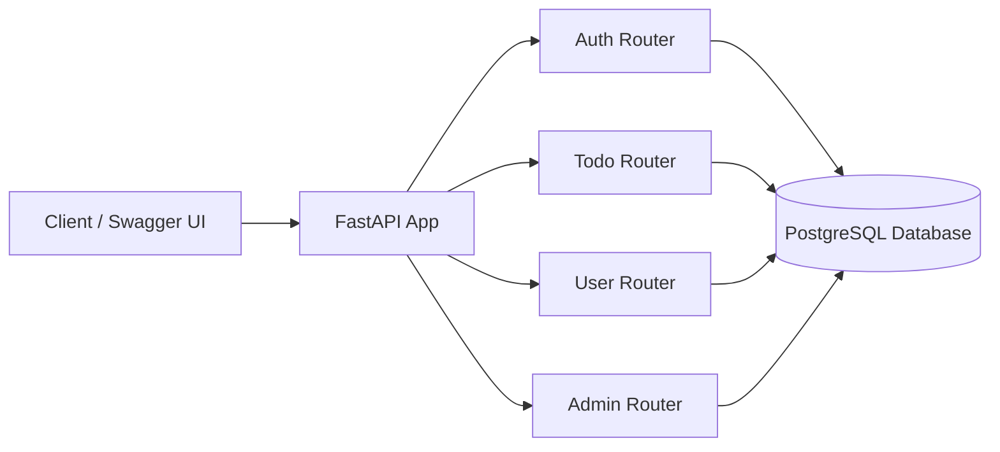
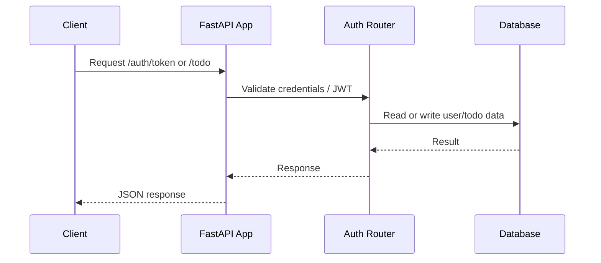

# FastAPI Todo App

This project is now a full-stack todo application with a FastAPI backend and a browser-based frontend. It supports user registration, login, protected todo CRUD, password updates, phone number updates, and admin-level management of users and todos, all through a polished Jinja templates UI.

## What the app includes

- User registration and login with JWT-based authentication
- Secure password hashing with `passlib`
- Personal todo CRUD routes that only allow the logged-in user to manage their own items
- Password change and phone number update endpoints
- Admin-only routes for reading and managing all todos and users
- A health check endpoint at `/health`
- SQLAlchemy models backed by PostgreSQL
- Jinja2 HTML templates for login, registration, todo listing, and todo editing
- Bootstrap-based UI served from the FastAPI app
- Client-side JavaScript for login, registration, todo creation, editing, and deletion
- Token-based authentication using cookies and JWT

## Main project files

- `main.py`  
  Creates the FastAPI app, registers all routers, and exposes the health endpoint.

- `database.py`  
  Configures the SQLAlchemy engine and session factory. The app currently uses PostgreSQL.

- `models.py`  
  Defines the `Users` and `Todos` database models.

- `routers/auth.py`  
  Handles user creation, login, JWT token generation, and authentication helpers.

- `routers/todos.py`  
  Provides CRUD endpoints for todos belonging to the current user.

- `routers/users.py`  
  Lets the current user view their profile and change their password or phone number.

- `routers/admin.py`  
  Gives admin users access to manage all todos and users.

- `alembic/`  
  Stores migration configuration and versioned database changes.

- `templates/`  
  Contains the HTML pages for the app UI, including login, registration, the todo list, and add/edit todo pages.

- `static/`  
  Holds CSS and JavaScript assets used by the frontend, including the client-side logic for interacting with the API.

- `test/`  
  Contains pytest tests for authentication, admin, todos, and the main app.

## Architecture overview



## Local development

Run the app from the parent folder of this project, which is the `fastAPI` directory.

### 1. Activate your virtual environment

On Windows PowerShell:

```powershell
.\.fastapi_env\Scripts\Activate.ps1
```

### 2. Set up PostgreSQL and the database tables

The app expects a PostgreSQL database named `TodoApplicationDatabase` on `localhost`.

#### Option A: Install PostgreSQL and pgAdmin 4

1. Download PostgreSQL from the official site:
   - https://www.postgresql.org/download/
2. Install PostgreSQL and make sure the PostgreSQL server is running.
3. Download pgAdmin 4 here:
   - https://www.pgadmin.org/download/
4. Open pgAdmin 4 and connect to your local PostgreSQL server.

#### Option B: Create the database

1. In pgAdmin 4, right-click `Databases` and choose `Create` -> `Database`.
2. Name the database `TodoApplicationDatabase`.
3. Click `Save`.

#### Option C: Run the SQL setup script

1. Open the SQL file at `ToDoApp/PostgreSQL_init_script.sql`.
2. In pgAdmin 4, right-click the `TodoApplicationDatabase` database and choose `Query Tool`.
3. Paste the contents of `PostgreSQL_init_script.sql` into the query editor.
4. Click `Execute` (or press `F5`) to run the script.
5. The script will create the `users` and `todos` tables.

You can verify the tables by expanding:

```text
Servers -> PostgreSQL -> Databases -> TodoApplicationDatabase -> Schemas -> public -> Tables
```

> If you use different PostgreSQL credentials than the defaults in `ToDoApp/database.py`, update the connection string in that file accordingly.

##### Reference
- Installing PostgreSQL in [Windows](https://www.udemy.com/course/fastapi-the-complete-course/learn/lecture/30831856#overview) | [Mac](https://www.udemy.com/course/fastapi-the-complete-course/learn/lecture/30831862#overview)

### 3. Start the API

From the parent folder:

```bash
uvicorn ToDoApp.main:app --reload
```

If you prefer to be explicit about the app directory:

```bash
uvicorn ToDoApp.main:app --reload --app-dir .
```

### 4. Open the app in your browser

Once the server is running, open:

```text
http://127.0.0.1:8000/
```

This redirects to the todo page. You can also open the interactive API docs at:

```text
http://127.0.0.1:8000/docs
```

and:

```text
http://127.0.0.1:8000/redoc
```

## API flow



1. A client sends a request to the FastAPI app.
2. The request is routed to the correct router.
3. The router uses SQLAlchemy to read or write data.
4. Protected routes validate a JWT bearer token before allowing access.

## Example workflow

### Through the browser UI

- Open the app at `http://127.0.0.1:8000/`
- Register a new account from the register page
- Log in with your credentials
- Create, edit, and view todos from the todo page
- Use the navigation to move between login, registration, and todos

### Through the API

- Create a user with `POST /auth/`
- Log in with `POST /auth/token` to obtain a JWT token
- Use the token in the `Authorization` header as `Bearer <token>`
- Create, read, update, or delete todos with the `/todos/todo` endpoints
- Admin users can access `/admin` endpoints to manage all resources

## Testing

Run the test suite from the parent folder:

```bash
pytest ToDoApp/test -q
```

## Notes

- Passwords are hashed before being stored.
- JWT tokens are used to protect private routes.
- Admin access is determined by the `role` field on the user record.

## Reference

- 